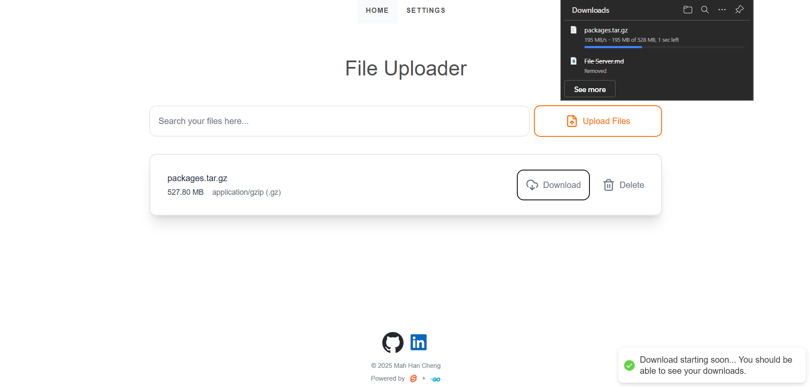
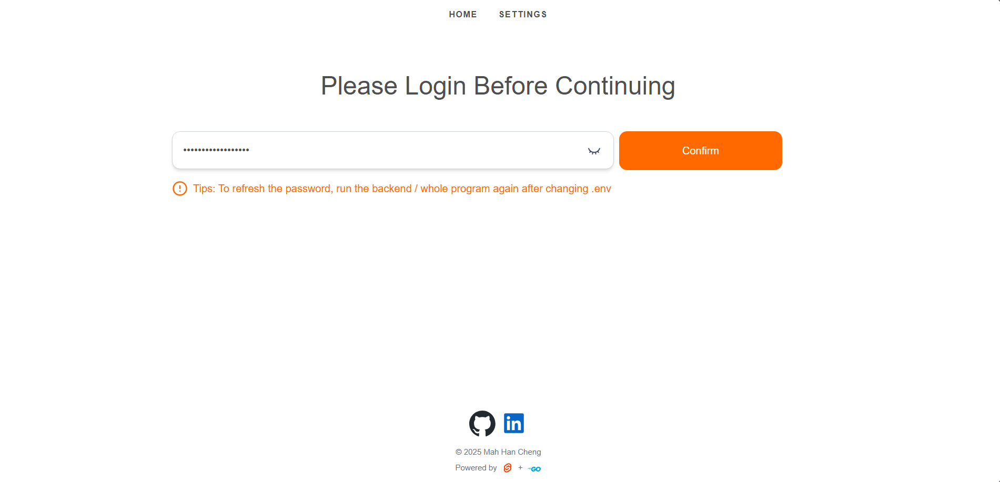
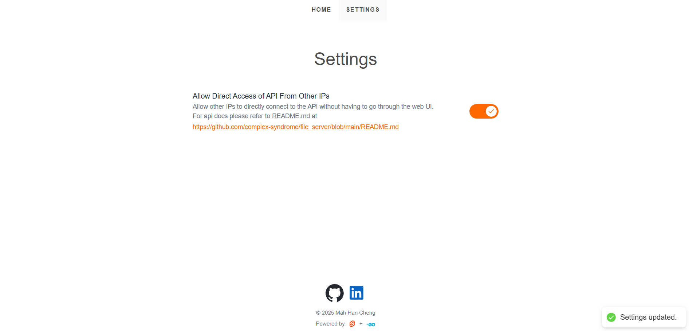
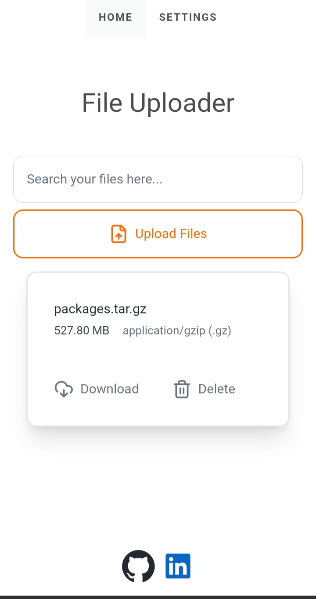
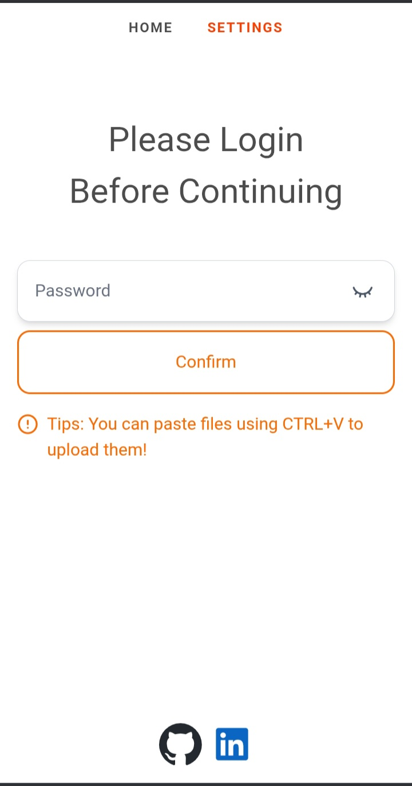
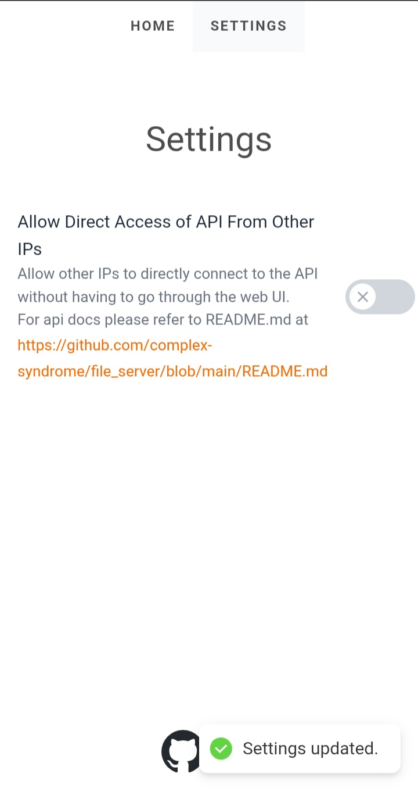

A file server / cloud-like storage webpage created for uploading and downloading files fast, sharing across multiple people and devices locally.

## Install setup
Bun and golang should be installed:
https://bun.sh/
https://go.dev/doc/install

1. Clone the repository:
```sh
git clone https://github.com/complex-syndrome/file_server.git
cd file_server
```

2. Run the program:
For windows:
```ps1
.\build.bat
.\start.bat
```

For linux / macOS:
```sh
./build.sh
./start.sh
```

### Using WebUI
- Upload files
	1. An upload button that can upload multiple files from explorer
	2. Pasting of files is also supported
	3. Repeated file names will be suffixed as file.txt, file.txt.1, file.txt.2 etc.

- Delete files
	1. Click the delete button and confirmation popup

- Search files
	1. A search bar is provided to fuzzy search files

- Login
	1. Safeguards settings
	2. Requires to login again for every reload

- Settings
	1. Require password set in `file_server/.env` to access it
	2. Refer to webpage for available settings

- Dynamic reload is available for all operations (upload, delete, edit settings)

### Using the API
To use the API directly from other machines, `AllowOtherIPs` should be set to `true` in settings.

#### Available commands:
- List all files in resource folder:
```sh
curl http://SERVER_IP:FRONTEND_PORT/api/list
```

- Download a file from the resource folder:
```sh
curl http://SERVER_IP:FRONTEND_PORT/api/download?file=FILE_NAME
```

- Upload a file to the resource folder:
```sh
curl http://SERVER_IP:FRONTEND_PORT/api/upload -X POST -F file=@FILE_NAME
```

**Before continuing: The commands onwards are limited to localhost only**

- Delete a file from the resource folder:
```sh
curl http://localhost:FRONTEND_PORT/api/delete?file=FILE_NAME -X DELETE
```

- List all settings:
```sh
curl http://localhost:FRONTEND_PORT/api/settings/list
```

- Update settings:
```sh
curl "http://localhost:FRONTEND_PORT/api/settings/update" -X POST -d "{\"SETTING_KEY\": SETTING_VALUE}"
```

## Why was it built?
- Have a tool to share files across devices
- Have control about what services I'm using
- Learn something new and get experience
- Ease of setup without login hassle

## Program screenshots








## Code
### Tools used
- **Golang** (backend api): Quick, makes http easy and is a new language to try
- **Svelte** (frontend page): Lightweight, easy to use, a new framework for learning web development and reactivity.
- **TypeScript** (frontend logic): Type safety that prevents bugs and reduces my pain on handling dynamic types (i love static typing)
- **TailwindCSS** (CSS framework): Without having to choose hex values of colors are a godsend (I praise to gods for having this)
- **Bun** (package manager): The main reason is just because it is a new stuff to try, but it is also undeniably faster than npm in dev environment

### Dependencies
- **svelte-french-toast**: Toast notifications that helped a lot in providing feedback to user
- **lucide/svelte**: Library that has many icons to use and provide visual indicators to users

## Author
Mah Han Cheng (me)
- [Linkedln](https://github.com/complex-syndrome)
- [Github](https://www.linkedin.com/in/mah-han-cheng-688323314/)